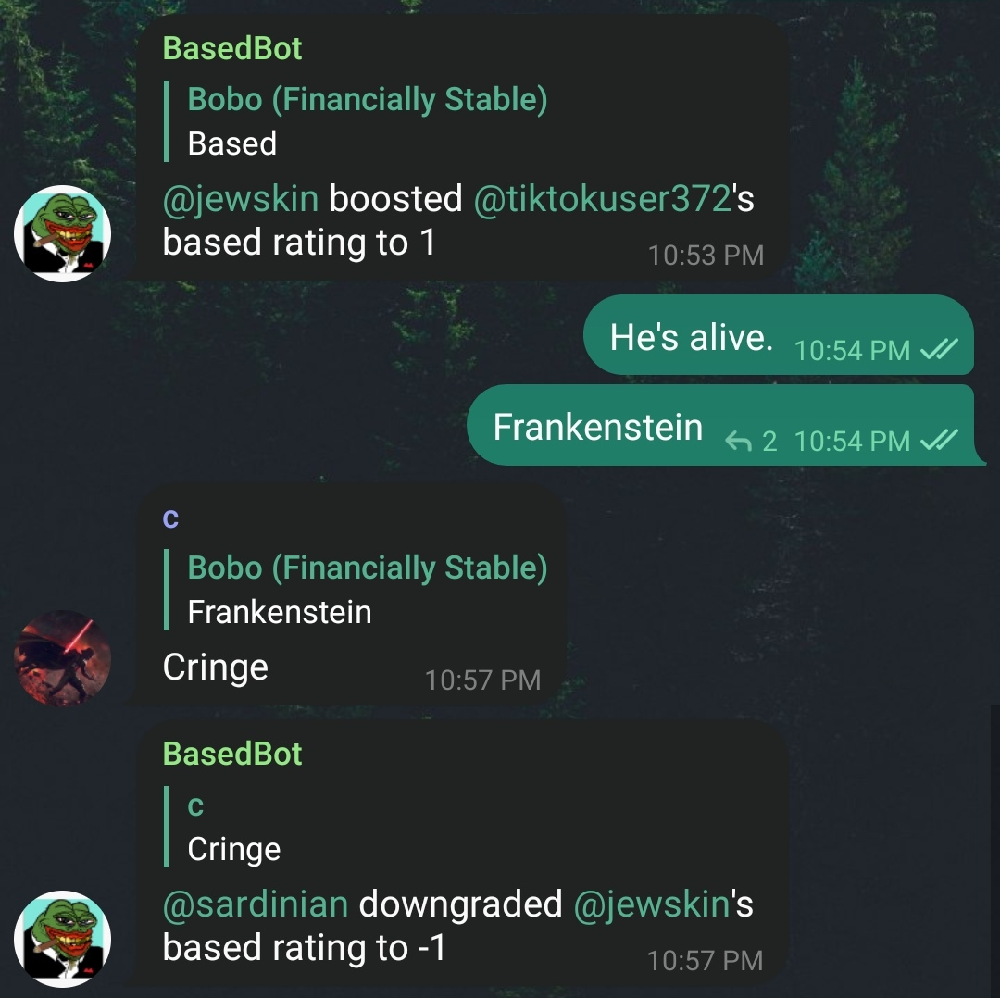

# BasedBot v1
Telegram bot that determines if you're based or cringe.

## How to run it
1. Install Python3.
2. Install [pyTelegramBotAPI](https://github.com/eternnoir/pyTelegramBotAPI).
3. Clone this repository.
4. Execute `nohup python3 bot.py &`, then hit enter.
5. Bot will run as a background process, unaffected by **SIGHUP**.

## What it does
1. BasedBot is added to a telegram group by a member.

2. BasedBot will then initialize a list of current members and set their based scores to 0.

3. BasedBot will monitor the chat for replies to non-bot users consisting of "based" or "cringe" (not CAPS sensitive).

4. BasedBot will announce changes in based scores to the chat, a message may look like: 
  **BasedBot:** *@user1* downgraded *@user2*'s based rating to **-1**. 
  **BasedBot:** *@user2* boosted *@user1*'s based rating to **6**.

## Bugs
1. A user could change their username and effectively reset their score.
2. On the rare chance that another user takes that username, their score will not begin at the prior score.

## Todo List
1. Fix above bugs (Look into unique user ids for each username, provided by the Telegram API)
2. Save based scores to a file, this bot will reset all scores upon stopping.
